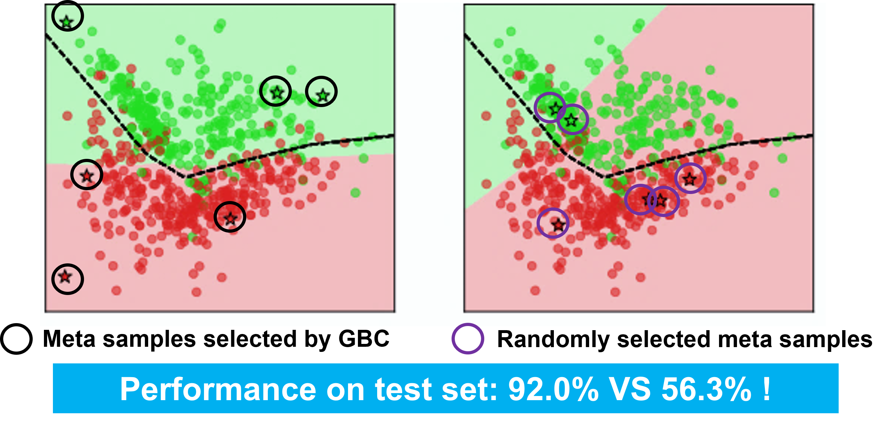

Code for the paper:
> Yinjun Wu, Adam Stein, Jacob Gardner, Mayur Naik, "Learning to Select Pivotal Samples for Meta Re-weighting " (AAAI 2023 oral)




# Install the pre-requiste:
```
pip install -r requirements.txt
```

# How to run the code for meta sample selections

We can use the following command to select 20 validation samples by using our methods on cifar10 dataset where 60% labels are polluted. Note that this is separated into three phases. In the first phase, we pretrain the model by using all the noisy training samples, which is assumed to have log directory "/path/to/logs0/". Then in the second phase, we use our methods to collect the remaining set of samples, which will use some cached information from the previous run with random sampling. So it will use two log directories, one is "/path/to/logs0/" (the log directory for storing logs in the first phase) while the other one is "/path/to/logs1/" (the log directory for storing the logs in the second phase):

```
cd src/main/
###initial training by using all noisy training samples

CUDA_VISIBLE_DEVICES=${gpu_id} python -m torch.distributed.launch   --nproc_per_node ${num_gpus}   --master_port 10032   main_train.py  --data_dir /path/to/data/   --dataset MNIST   --meta_lr 30   --flip_labels  --biased_flip   --err_label_ratio 0.6   --save_path /path/to/logs0/   --cuda   --lr 0.1   --batch_size 4096   --test_batch_size 128   --epochs 500   --do_train


###Selecting meta samples by using RBC 

CUDA_VISIBLE_DEVICES=${gpu_id} python -m torch.distributed.launch  --nproc_per_node ${num_gpus}     --master_port 10032 main_train.py --load_dataset --data_dir /path/to/data/  --dataset cifar10  --valid_count 20     --meta_lr 30     --not_save_dataset     --flip_labels     --biased_flip     --err_label_ratio 0.6  --save_path /path/to/logs1/  --prev_save_path /path/to/logs0/    --cuda     --lr 0.1     --batch_size 128     --test_batch_size 128     --epochs 150  --select_valid_set --cluster_method_two --weight_by_norm  --cosin_dist --total_valid_sample_count 20 --use_pretrained_model --lr_decay

### Selecting meta samples by using GBC

CUDA_VISIBLE_DEVICES=${gpu_id} python -m torch.distributed.launch  --nproc_per_node ${num_gpus}     --master_port 10032 main_train.py --load_dataset --data_dir /path/to/data/  --dataset cifar10  --valid_count 20     --meta_lr 30     --not_save_dataset     --flip_labels     --biased_flip     --err_label_ratio 0.6  --save_path /path/to/logs1/  --prev_save_path /path/to/logs0/    --cuda     --lr 0.1     --batch_size 128     --test_batch_size 128     --epochs 150  --select_valid_set --cluster_method_three --weight_by_norm  --cosin_dist --total_valid_sample_count 20 --use_pretrained_model --lr_decay

```


in which "--flip_labels" determines whether to pollute the training set, "--err_label_ratio" determines how many samples are polluted, "--load_dataset" is used to load the existing noisily labeled dataset generated by the previous run (if not generate newly dirty labels), which is for controlling the randomness from the generated noisy labels, "--continue_label" represents to load the cached training datasets from the previous run, "--load_cached_weights" is a flag to indicate the cached weights on training samples produced by the previous run, "--cached_sample_weights_name" represents the file name of cached weights from the previous run, "--prev_save_path" represents the log directory of the previous run, "--select_valid_set" is a flag to indicate the use of our method, "--lr_decay" is a flag for decaying the learning rate for meta-learning, "--cosin_dist" is a flag for using cosine similarity during k-means clustering, "--cluster_method_two" indicates that we are using RBC, which is the default method (an alternative flag is "--cluster_method_three" which indicates that we are using GBC),  "--weight_by_norm" indicates the use of weighted k-means.


